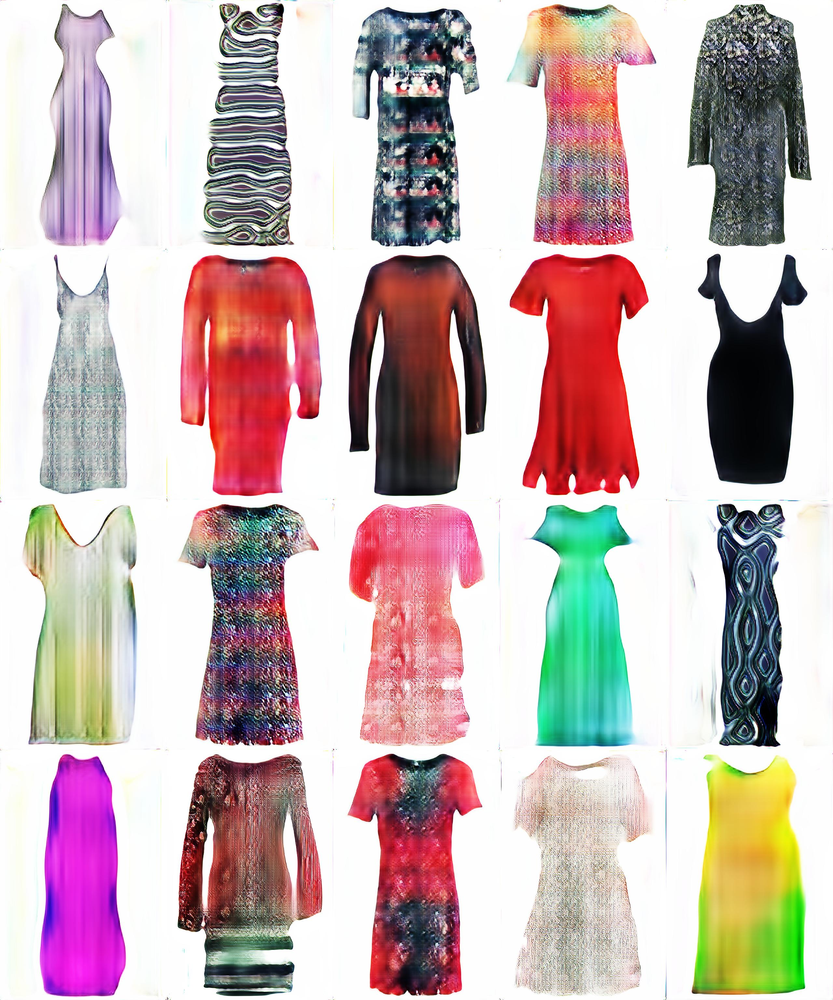

# Multi-Scale Gradient GAN

This an implementation of [MSG-GAN: Multi-Scale Gradient GAN for Stable Image Synthesis](https://arxiv.org/abs/1903.06048).

## Notes

This implementation differs from the one in the original paper.

1. To regularize the discriminator I use R1 penalty.
2. To improve sample diversity I use PacGAN discriminator.
3. I use a stylegan-like generator (or you could call it a self modulation):  
latent vector injection with AdaIN layers.

## How to train
1. Put your images in a folder.
2. Edit training config in the beginning of `train.py` file.
3. Run `python train.py` for training.
4. Run `tensorboard --logdir=summaries/run00/` to view losses.
5. Use `generation.ipynb` to generate samples with a trained model.

## Example of generated samples

For training I used [FEIDEGGER dataset](https://github.com/zalandoresearch/feidegger).  All hyperparameters that I used are in `train.py`.  
Note that the generated samples came from different epochs.

## Requirements
1. pytorch 1.2
2. tqdm, Pillow 6.1
3. tensorboard 1.14

## Acknowledgments

This code is based on

1. [akanimax/BMSG-GAN](https://github.com/akanimax/BMSG-GAN)
2. [rosinality/style-based-gan-pytorch](https://github.com/rosinality/style-based-gan-pytorch)

## Relevant papers

1. [On Self Modulation for Generative Adversarial Networks](https://arxiv.org/abs/1810.01365)
2. [A Style-Based Generator Architecture for Generative Adversarial Networks](https://arxiv.org/abs/1812.04948)
3. [PacGAN: The power of two samples in generative adversarial networks](https://arxiv.org/abs/1712.04086)
4. [Which Training Methods for GANs do actually Converge?](https://arxiv.org/abs/1801.04406)
